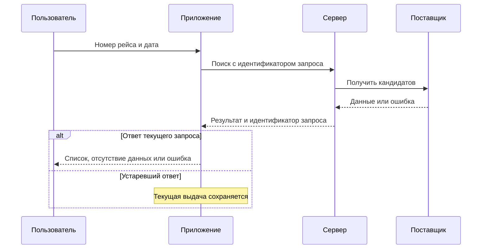

[← К списку кейсов](README.md)

# Кейс 1. AirTrack Companion: пользователь открывает не тот вылет

## Проблема и границы

Пользователь встречает пассажира и ищет рейс по номеру и дате. Номер повторяется по дням, время может отображаться в разных часовых поясах, а ответ на предыдущий запрос может прийти позже нового. Общая формулировка «улучшить поиск» не определяет, какой вылет считать подходящим.

Цель: пользователь осознанно выбирает конкретный вылет, а интерфейс не подменяет его другим результатом.

В границы входят ввод, обработка результата, выбор карточки, ошибки и повторный запрос. Полнота данных поставщика, изменение его тарифа и прогноз задержек не входят.

## Вопросы, которые нужно согласовать до реализации

1. Дата в поиске — местная календарная дата отправления или другая договорённость?
2. Какая дата и какое время возвращаются поставщиком? Есть ли часовой пояс аэропорта?
3. Что отличает один вылет от другого: устойчивый идентификатор, маршрут, время?
4. Можно ли получить несколько кандидатов и уточнить дату по полям результата?
5. Что делать, если данных недостаточно для однозначного сопоставления?

**Исходные условия:** дата пользователя означает местную дату отправления; источник предоставляет идентификатор вылета, время и сведения, необходимые для интерпретации часового пояса. Если такой поддержки у реального источника нет, правило поиска требует пересмотра, а не скрытого угадывания.

## Правила

| ID | Правило | Зачем |
|---|---|---|
| AIR-BR-01 | Выбранная дата трактуется как местная дата отправления | Один смысл для клиента и команды |
| AIR-BR-02 | При нескольких подходящих вылетах решение принимает пользователь | Исключить случайный выбор первого совпадения |
| AIR-BR-03 | Ответ относится к конкретному запросу; устаревший ответ не меняет текущую выдачу | Не подменить результат после изменения даты |
| AIR-BR-04 | Пустой успешный ответ и техническая ошибка имеют разные состояния | Не сообщать «рейса нет», когда источник недоступен |
| AIR-BR-05 | После ошибки сохраняются дата и введённый номер | Позволить повторить действие без ввода заново |

## Требование AIR-FR-01: выдача подходящих вылетов

**User Story:** как встречающий пассажира, я хочу найти конкретный вылет на выбранную дату, чтобы проверить его маршрут и время прибытия.

**Предусловия:** номер прошёл согласованную проверку формата, дата выбрана, запрос получил идентификатор в приложении.

| Поле примера | Источник | Использование |
|---|---|---|
| search_request_id | Приложение | Связать выдачу с текущим поиском |
| flight_instance_id | Контракт поставщика | Идентифицировать конкретный вылет |
| departure_datetime | Контракт поставщика | Получить дату с корректной трактовкой времени |
| departure_timezone | Контракт/согласованный справочник | Интерпретировать местную дату |
| origin, destination | Поставщик | Отличить совпадения для пользователя |
| data_updated_at | Поставщик, если поле доступно | Показать актуальность, не подменяя временем запроса |

Таблица задаёт внутреннюю модель данных; соответствие полям поставщика фиксируется в контракте интеграции.

**Критерии приёмки:**

- Один кандидат: доступна его карточка с датой и маршрутом.
- Несколько кандидатов: показан список; произвольная карточка не открывается автоматически.
- Данных для трактовки даты недостаточно: неоднозначность не скрывается за якобы точным совпадением.
- Ответ успешный и пустой: состояние «подходящие рейсы не найдены».
- Таймаут или ошибка: сообщение о временной недоступности и повторная попытка.
- При новом запросе предыдущий ответ не меняет текущую выдачу.

## Схема взаимодействия

## Решение, альтернатива и ошибка

**Решение:** уточнить семантику данных, разделить состояния и добавить явный выбор кандидата.

**Альтернатива:** заменить поставщика. Её рано принимать, пока не отделены ошибки источника от неверной трактовки на стороне приложения.

**Ошибка и исправление:** первоначально описаны только успех и ошибка; поздний ответ предыдущего запроса пропущен. После его обнаружения добавляется AIR-BR-03 и сценарий AIR-UAT-03.

## Приёмка: подготовлена, но не выполнена

| ID | Проверка | Ожидаемый результат |
|---|---|---|
| AIR-UAT-01 | Два вылета с одинаковым номером | Показан выбор с датой и маршрутом |
| AIR-UAT-02 | Успешный пустой ответ и отдельно таймаут | Разные состояния, ввод сохранён |
| AIR-UAT-03 | Сначала запрос A, затем B; ответ A приходит последним | На экране остаётся результат B |
| AIR-UAT-04 | Вылет около полуночи, различаются UTC-день и местная дата | Применяется AIR-BR-01; недостающие данные не угадываются |

## Метрика и ограничения

В двух шестинедельных выборках возврат на уточнение требований указан для 13 из 37 и 6 из 41 завершённого изменения. В Excel сохранено разделение на интерфейсные и интеграционные задачи.

Для расчёта нужны история задач, причины возврата и единое правило отбора. Новые пожелания не считаются пропущенными требованиями. Показатель завершённых задач может скрывать сложные незавершённые изменения, поэтому цикл всех поступивших задач надо анализировать отдельно.

**Короткий рассказ:** «Я разложил жалобу на конкретные правила: как трактовать дату, выбирать вылет и обрабатывать ответы. Подготовил спецификацию и критерии приёмки. Показатель качества требований — 13 возвратов из 37 изменений до и 6 из 41 после. Он описывает работу с требованиями; выводов о выручке по нему я не делаю».
