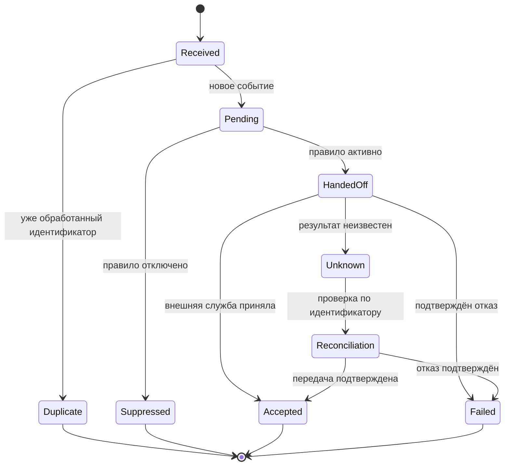

[← К списку кейсов](README.md)

# Кейс 2. HarborWatch: одинаковое уведомление не всегда означает один дефект

## Проблема и границы

Пользователь получает похожие сообщения и считает их дублями. Поддержка отправляет скриншот вендору, хотя причина может находиться в источнике события, обработке в приложении или доставке.

Цель: сделать правила повторов и маршрутизацию инцидентов однозначными. В границы не входит обещание гарантированного показа push на устройстве или отмены сообщения, уже принятого внешней службой доставки.

## Сущности

| Сущность | Значение | Что нельзя с ней путать |
|---|---|---|
| Правило отслеживания | Пользователь, судно, тип события, активность | Событие, которое уже произошло |
| Событие источника | Конкретное изменение данных о судне | Каждую повторную доставку этого изменения |
| Попытка отправки | Техническая операция передачи сообщения | Доказанный просмотр пользователем |

## Правила

| ID | Правило |
|---|---|
| HBR-BR-01 | Если поставщик гарантирует устойчивый идентификатор события, повтор с тем же идентификатором для того же правила не создаёт новую независимую доставку |
| HBR-BR-02 | Разные события одного судна не объединяются только из-за сходства текста или близости времени |
| HBR-BR-03 | Перед передачей сообщения на отправку проверяется актуальность разрешения пользователя |
| HBR-BR-04 | После принятия сообщения внешней службой его отзыв не гарантируется |
| HBR-BR-05 | Эскалация содержит достаточные идентификаторы и последовательность событий; неизвестные значения обозначаются явно |

**Открытый вопрос:** что гарантирует поставщик, если у него нет стабильного event_id? В этом случае точное распознавание повторов нельзя обещать. Нужны отдельное согласование и описание риска ложного объединения.

## Требование HBR-FR-01: обработать повтор и отключение

**User Story:** как пользователь, я хочу управлять отслеживанием и понимать, почему пришло сообщение, чтобы не получать необъяснимые повторные уведомления.

**Минимальный контекст события:** source_event_id, tracking_rule_id, event_type, occurred_at, received_at, dispatch_attempt_id. Имена относятся к внутренней модели; соответствие контракту поставщика согласуется отдельно.

**Критерии приёмки:**

- Повтор одного идентифицированного события не создаёт новую независимую доставку для того же правила.
- Два разных события не подавляются только потому, что относятся к одному судну.
- Если правило отключено до проверки перед отправкой, новое сообщение по нему не передаётся.
- Если внешняя доставка уже приняла сообщение, интерфейс не обещает его отзыв.
- Диагностическая запись позволяет связать правило, событие и попытку отправки.

## Таблица маршрутизации

| Наблюдение | Следующая проверка | Владелец разбора |
|---|---|---|
| Повтор одного source_event_id | Созданы ли отдельные внутренние доставки | Backend команды приложения |
| Разные source_event_id при одинаковом событии по смыслу | Значение идентификатора и гарантии источника | Вендор после внутренней проверки |
| Одна отправка, жалоба на два отображения | Получение и обработка на устройстве | Мобильная разработка совместно с QA |
| Отключение и отправка почти одновременно | Порядок фиксации отключения и передачи сообщения | Команда приложения |
| Недостаточно идентификаторов | Собрать минимальный комплект, отметить недоступные поля | Поддержка |

Это порядок диагностики, а не автоматическое доказательство виновности стороны.

## Схема жизненного цикла обработки события

Accepted означает приём внешней службой, а не доставку или прочтение на устройстве. Повтор после Unknown не запускается вслепую: необходима безопасная процедура сверки с возможностями внешнего сервиса.

## Пример обращения к вендору — шаблон, не отправленная переписка

> Тема: уточнение идентичности двух событий в тестовой среде. Для одного судна получены два идентификатора с совпадающими типом и временем события. Прикладываем обезличенные ответы, время получения с часовым поясом и идентификаторы запросов. Просим уточнить: это два самостоятельных события или повтор одного? Какова область уникальности идентификатора и может ли он меняться при повторной доставке?

## Приёмка: подготовлена, но не выполнена

| ID | Проверка | Ожидаемый результат |
|---|---|---|
| HBR-UAT-01 | Один event_id доставлен дважды | Одна независимая доставка для одного правила |
| HBR-UAT-02 | Два разных события одного судна | Оба обработаны по действующим правилам |
| HBR-UAT-03 | Правило отключено до передачи сообщения | Новое сообщение подавлено |
| HBR-UAT-04 | После передачи нет подтверждения | Статус неизвестен; нет необоснованного успеха и слепого повтора |

## Альтернатива, ошибка и показатели

**Альтернатива:** подавлять любой похожий текст в течение нескольких минут. Риск — потерять полезное самостоятельное событие. Поэтому нужна идентичность, а не только временное окно.

**Ошибка и исправление:** не описано отключение правила при наличии события в очереди. Исправление — отдельное правило HBR-BR-03 и проверка HBR-UAT-03.

Из 26 и 29 инцидентов, переданных вендору в двух восьминедельных периодах, возвращены из-за неполного диагностического комплекта соответственно 9 и 3. Единица — уникальный инцидент, а не письмо. Календарные сроки ответа, число сообщений и выручка по этим числам не восстанавливаются.

**Короткий рассказ:** «Я разделил событие, правило отслеживания и попытку доставки. Описал повторную обработку, исключения и состав диагностики для вендора. Возвраты из-за неполных данных составили 9 из 26 инцидентов до и 3 из 29 после. Это показатель качества эскалации, а не частоты сбоев уведомлений».
