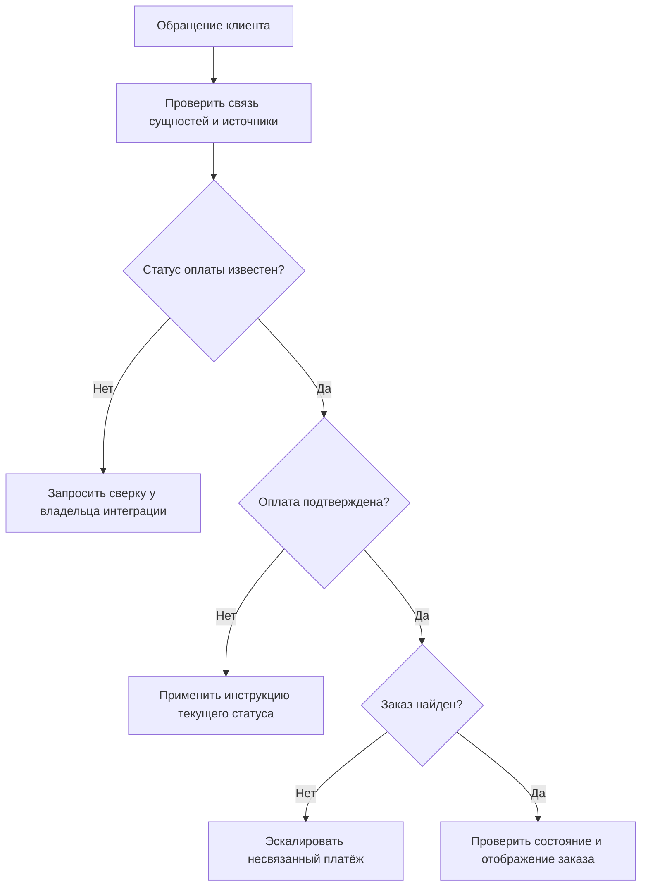
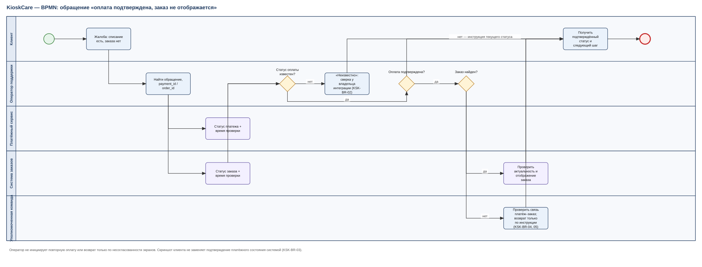
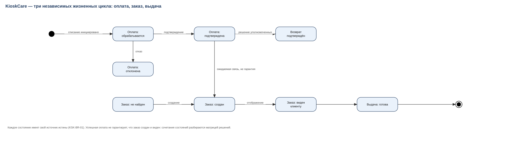
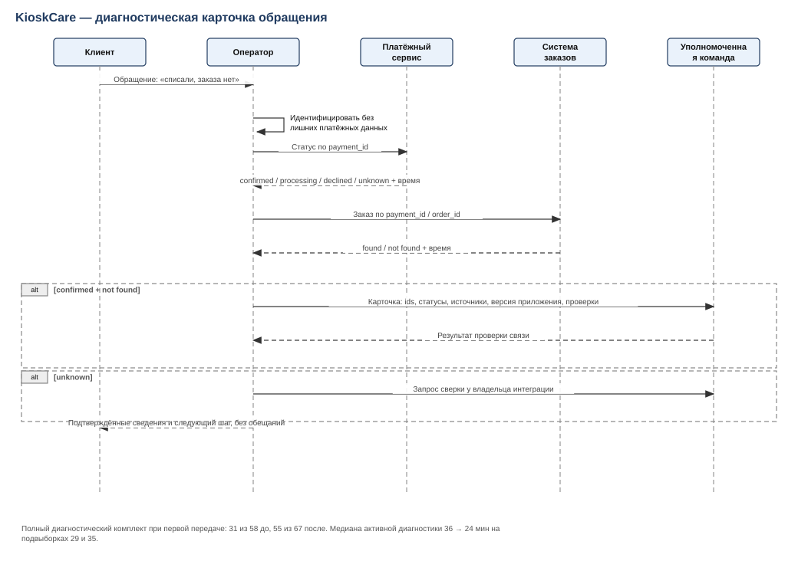
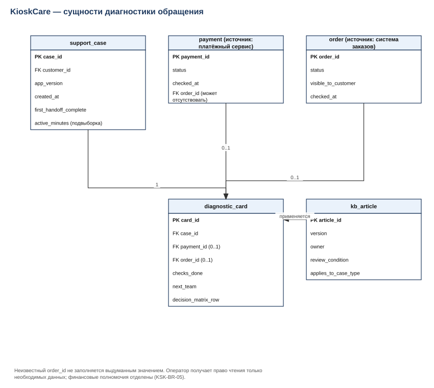

[← К списку кейсов](README.md)

# Кейс 3. KioskCare: оплата подтверждена, заказ не отображается

## Проблема и границы

Оператор поддержки видит жалобу, но не понимает, создан ли заказ, подтверждён ли платёж и можно ли выдавать товар. Цель — обеспечить диагностику и правильную эскалацию без повторной оплаты, выдачи или возврата по предположению.

В границах: отображение статусов, проверка связи сущностей, доступ к данным и инструкция. Финансовое решение о возврате, полноценная антифрод-система и автоматическое исправление заказа не входят.

## Правила

| ID | Правило |
|---|---|
| KSK-BR-01 | Оплата, заказ и выдача имеют независимые состояния и источники истины |
| KSK-BR-02 | Отсутствие доступного ответа показывается как «неизвестно», а не как «не оплачено» |
| KSK-BR-03 | Скриншот клиента не заменяет подтверждение платёжного состояния системой |
| KSK-BR-04 | Оператор не инициирует повторную оплату или возврат только по несогласованности экранов |
| KSK-BR-05 | Доступ к диагностике и финансовые полномочия разделены; операции фиксируются |
| KSK-BR-06 | Каждая инструкция содержит применимую версию, владельца и условие пересмотра |

## Требование KSK-FR-01: диагностическая карточка обращения

В карточке показываются идентификатор обращения, доступные идентификаторы заказа и платежа, статусы с источниками и временем проверки, версия приложения, проведённые проверки и следующая ответственная команда.

Неизвестный order_id не заполняется выдуманным значением. Поддержка получает право чтения только данных, необходимых для задачи. Номер карты, секреты доступа и полные платёжные реквизиты в диагностической карточке не нужны.

## Матрица решений

| Оплата | Заказ | Решение поддержки |
|---|---|---|
| Подтверждена | Не найден после корректного поиска | Передать на проверку связи платежа и заказа, не предлагать повторную оплату |
| Подтверждена | Создан, не виден клиенту | Проверить актуальность данных и отображение, направить в команду приложения |
| Обрабатывается | Не найден | Следовать согласованному процессу ожидания/сверки; не обещать итог |
| Отклонена | Не найден | Сообщить подтверждённый статус; дальнейшие действия по правилам сервиса |
| Неизвестна | Любое состояние | Восстановить сведения из источника или эскалировать; не делать вывод о списании |
| Возврат подтверждён | Любое состояние | Проверить связанную операцию и применять инструкцию возвратов уполномоченной команды |

Числовой срок ожидания нельзя выдумать: его владелец — бизнес совместно с владельцем платёжной интеграции. До согласования это открытый вопрос, а не произвольные «15 минут» в инструкции.

## Процесс принятия решения

Это схема решений в Mermaid, не файл BPMN 2.0. Для полноценной BPMN-модели отдельно потребуются роли, события и границы участников.

## Инструкция KB-KSK-01: первичная диагностика

**Применимость:** версия спецификации 1.0, клиент сообщает об оплате без видимого заказа. **Владелец роли:** руководитель поддержки. **Статус:** черновик, внедрение не выполнено.

1. Идентифицировать обращение и клиента по установленному процессу; не запрашивать лишние платёжные данные.
2. Найти доступную связь с заказом или платежом; отсутствие значения зафиксировать явно.
3. Проверить текущие статусы в соответствующих источниках и время проверки.
4. Использовать матрицу решений. При неизвестном состоянии не объявлять операцию успешной или неуспешной.
5. Передать идентификаторы, время, проверенные статусы, версию приложения и уже выполненные действия ответственной команде.
6. Сообщить клиенту подтверждённые сведения и следующий шаг без неподтверждённых обещаний.
7. После изменения процесса или интерфейса пересмотреть статью; старую версию пометить как заменённую.

Это одна полностью подготовленная статья. Упоминание 19 статей в рассказе остаётся условием истории: остальные 18 статей данным документом не созданы.

## Приёмка: подготовлена, но не выполнена

| ID | Проверка | Ожидаемый результат |
|---|---|---|
| KSK-UAT-01 | Подтверждённый платёж без найденного заказа | Эскалация связи, без повторной оплаты |
| KSK-UAT-02 | Источник оплаты недоступен | «Неизвестно», без ложного «не оплачено» |
| KSK-UAT-03 | Оператор пытается выполнить финансовое действие | Доступ ограничен согласованной ролью |
| KSK-UAT-04 | Нет order_id и есть проверенный payment_id | Передача возможна с явным отсутствием заказа |

## Альтернатива, ошибка и метрики

**Альтернатива:** сразу добавить кнопку возврата в карточку. Отложена до согласования полномочий, бизнес-процесса и интеграции.

**Ошибка и исправление:** инструкция опиралась на расположение кнопок и устарела после смены интерфейса. Решение — задача, ожидаемый результат и версия процедуры важнее скриншота.

Полный диагностический комплект при первой передаче — 31 из 58 обращений до и 55 из 67 после. Категория и правила комплектности одинаковые.

Медиана активного времени — 36 минут на подвыборке из 29 обращений и 24 минуты на подвыборке из 35. Значения внесены агрегатами; исходные длительности в комплект не включены, поэтому медианы в Excel не пересчитываются. Ожидание клиента и поставщика исключено.

**Короткий рассказ:** «Я описал, как оператор различает состояние оплаты и заказа, не принимает финансовое решение без полномочий и передаёт проверенный комплект данных. В кейсе есть матрица решений, инструкция и приёмочные сценарии».

## Схемы (Draw.io, редактируемые)

| Схема | Файл |
|---|---|
| BPMN процесса | [KSK-01](diagrams/KSK-01-bpmn-support-case.drawio) |
| Диаграмма состояний | [KSK-02](diagrams/KSK-02-state-payment-order.drawio) |
| Sequence интеграции | [KSK-03](diagrams/KSK-03-sequence-diagnostics.drawio) |
| ERD сущностей | [KSK-04](diagrams/KSK-04-erd-support.drawio) |

