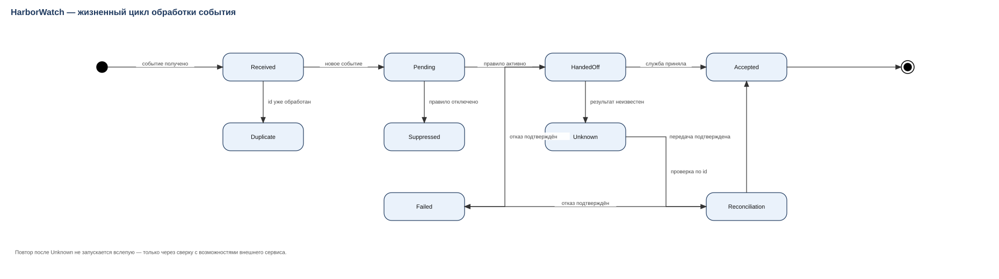

# Бизнес-анализ мобильных сервисов: три кейса с требованиями, приёмкой и метриками

Александр Кирилов · бизнес-аналитик · [kirilovalal@gmail.com](mailto:kirilovalal@gmail.com) · Telegram [@alekskirilov](https://t.me/alekskirilov) · кейсы Cetera — [ba-cases-cetera](https://github.com/kirilovalal/ba-cases-cetera)

Три изменения, которые я вёл как бизнес-аналитик в Softintermob (ноябрь 2024 — февраль 2026): от размытой жалобы до бизнес-правил, требований, критериев приёмки и измеренного результата. Названия проектов заменены на условные, имена участников изменены; цифры и структура документов — рабочие.

## Кейсы

| Кейс | Проблема | Что сделал | Результат |
|---|---|---|---|
| [AirTrack Companion](01-airtrack-flight-search.md) — поиск рейсов | «Открывается не тот рейс»: местная дата vs UTC-день у поставщика, несколько вылетов с одним номером, поздний ответ предыдущего запроса | Словарь данных, таблица соответствия полей, 5 бизнес-правил, состояния экрана, критерии приёмки, sequence-диаграмма | Возвраты задач на уточнение требований **13 из 37 → 6 из 41** (два периода по 6 недель) |
| [HarborWatch](02-harborwatch-notifications.md) — уведомления о судах | «Пришло дважды»: поддержка отправляла вендору всё подряд, скриншота не хватало для разбора | Разделил правило отслеживания, событие поставщика и попытку доставки; state-диаграмма; таблица маршрутизации инцидентов; [шаблон обращения к вендору](vendor-request-template.md) | Инциденты, возвращённые вендором из-за неполных данных, **9 из 26 → 3 из 29** (два периода по 8 недель) |
| [KioskCare](03-kioskcare-support.md) — поддержка заказов | «Деньги списаны, заказа не видно»: оплата, заказ и выдача живут в разных системах, оператор эскалирует наугад | Три независимых жизненных цикла, матрица решений, матрица доступа, диагностическая карточка, [инструкция первой линии](KB-KSK-01-first-line-diagnostics.md) | Полный диагностический комплект при первой передаче **31 из 58 → 55 из 67**; медиана активной диагностики **36 → 24 мин** |

В каждом кейсе есть отброшенная альтернатива и моя ошибка с тем, как её исправил.

## Что в репозитории

| Файл | Что внутри |
|---|---|
| `01-airtrack-flight-search.md`, `02-harborwatch-notifications.md`, `03-kioskcare-support.md` | Три спецификации: бизнес-правила (BR), требования (FR), критерии приёмки, ссылки на схемы |
| [`diagrams/`](diagrams/) | 12 схем Draw.io — по четыре на кейс: BPMN процесса, диаграмма состояний, sequence интеграции, ERD сущностей. `.drawio` открывается в diagrams.net, `.svg` — превью |
| [`uat-registry.md`](uat-registry.md) | Реестр из 12 UAT-сценариев со связью на правила и требования |
| [`BA_Cases_Metrics.xlsx`](BA_Cases_Metrics.xlsx) | Исходные агрегаты, расчёт долей и разниц с проверкой знаменателей, редактируемый реестр приёмки |
| [`powerbi/`](powerbi/) | Данные, модель, DAX-меры и макет дашборда по шести кейсам обеих компаний; инструкция сборки `.pbix` |
| [`KB-KSK-01-first-line-diagnostics.md`](KB-KSK-01-first-line-diagnostics.md) | Инструкция базы знаний: версия, владелец, условие пересмотра |
| [`vendor-request-template.md`](vendor-request-template.md) | Шаблон технического обращения к поставщику данных |
| [`BA_Softintermob_Story_RU.md`](BA_Softintermob_Story_RU.md) | Связный рассказ о роли: команда, границы ответственности, инструменты, процесс |

## Схемы

| | BPMN | Состояния | Sequence | ERD |
|---|---|---|---|---|
| AirTrack Companion | [AIR-01](diagrams/AIR-01-bpmn-flight-search.svg) | [AIR-02](diagrams/AIR-02-state-search-request.svg) | [AIR-03](diagrams/AIR-03-sequence-search.svg) | [AIR-04](diagrams/AIR-04-erd-flight-search.svg) |
| HarborWatch | [HBR-01](diagrams/HBR-01-bpmn-notification.svg) | [HBR-02](diagrams/HBR-02-state-event.svg) | [HBR-03](diagrams/HBR-03-sequence-escalation.svg) | [HBR-04](diagrams/HBR-04-erd-tracking.svg) |
| KioskCare | [KSK-01](diagrams/KSK-01-bpmn-support-case.svg) | [KSK-02](diagrams/KSK-02-state-payment-order.svg) | [KSK-03](diagrams/KSK-03-sequence-diagnostics.svg) | [KSK-04](diagrams/KSK-04-erd-support.svg) |

Идентификаторы сквозные: `AIR-BR-03` → `AIR-FR-01` → `AIR-UAT-03` → схема `AIR-03`. По любому сценарию приёмки можно найти правило, которое он проверяет.

## Как считались метрики

Все показатели — доли с числителем и знаменателем, без процентов вместо исходных чисел. Единицы измерения зафиксированы: уникальная задача (не число уточнений), уникальный инцидент (не письмо), уникальное обращение. Периоды сопоставимые, новые пожелания и дефекты кода классифицированы отдельно. Что эти цифры **не** доказывают, написано рядом с каждой: сравнение до/после показывает динамику, а не изолированный причинный эффект, и не переводится в выручку.

## Инструменты

Jira, Confluence, GitLab (merge request для документации) · BPMN, UML (state, sequence), ERD · Draw.io · Excel (Power Query, сводные, СЧЁТЕСЛИМН / ПРОСМОТРX) · Power BI (модель, DAX) · Postman · SQL
