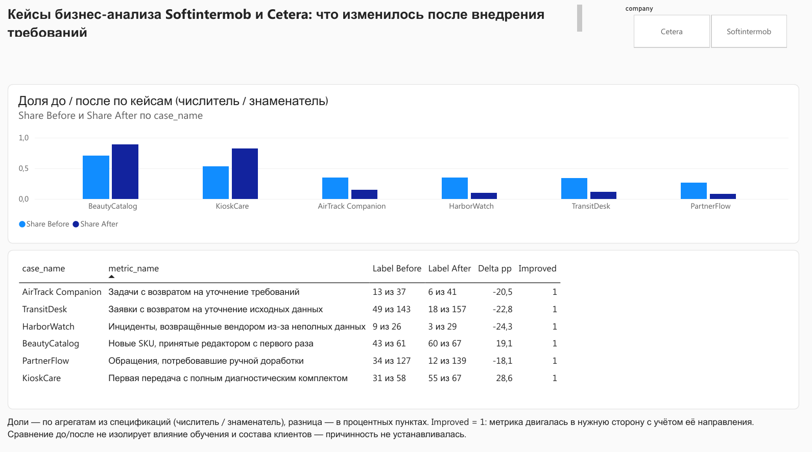
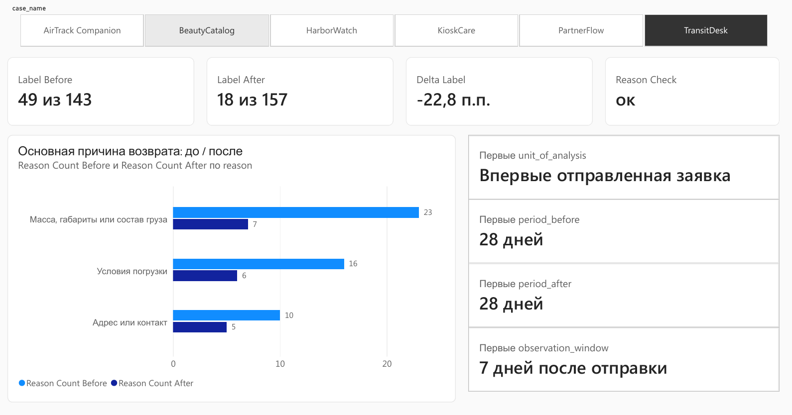
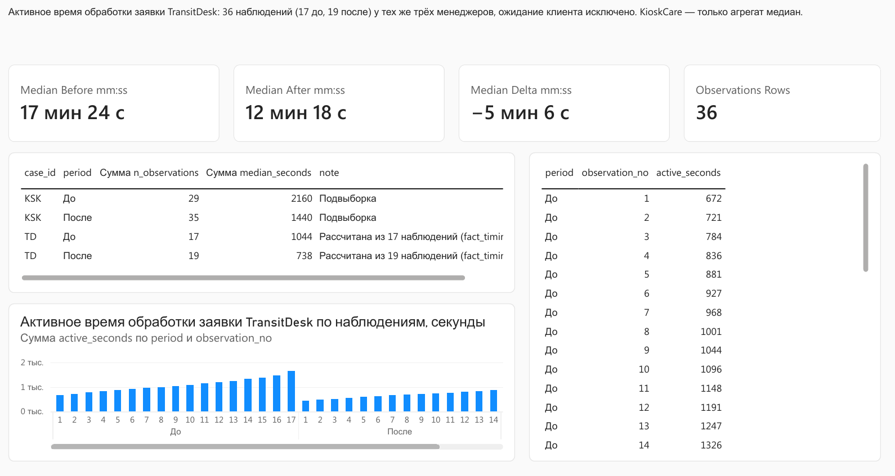
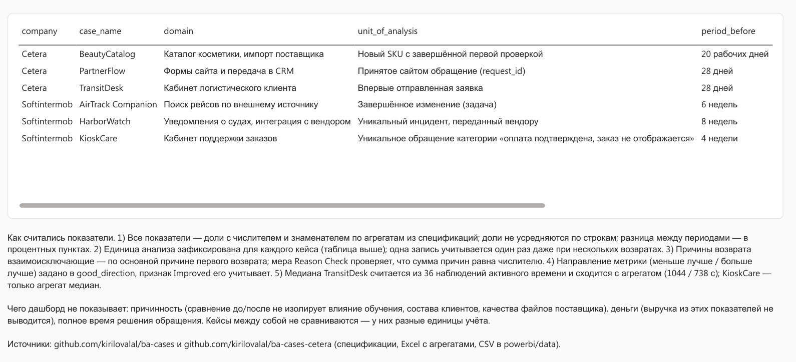

[← К списку кейсов](../README.md)

# Power BI: показатели шести кейсов до / после

Дашборд по результатам кейсов Softintermob и Cetera. Данные — только рабочие агрегаты из спецификаций: числители, знаменатели, распределение причин и 36 наблюдений активного времени TransitDesk. Построчных журналов заявок, SKU и обращений в комплекте нет, поэтому детализации ниже уровня агрегата на дашборде не будет — и это честнее, чем сгенерированная синтетика.

Готовый файл — [`BA_Cases_Dashboard.pbix`](BA_Cases_Dashboard.pbix) (Power BI Desktop, импорт из CSV, 32 меры, четыре страницы). Ниже — скриншоты страниц; в репозитории лежит всё, из чего файл собран: данные, модель, меры, макет, инструкция сборки.

## Страницы

**Итоги** — шесть кейсов рядом: доля «до» и «после» по каждому, таблица «n из N», разница в п.п. и признак улучшения. Срез по компании.

**Кейс** — один выбранный кейс: «было / стало», распределение основной причины возврата до и после, проверка сходимости причин с числителем (`Reason Check`), единица анализа и окна наблюдения.

**Время** — единственные построчные данные: 36 наблюдений активного времени обработки заявки TransitDesk, медианы до/после из строк и их сходимость с агрегатом.

**Методика** — таблица кейсов с единицами анализа и длиной периодов и текст о том, как считались показатели и чего они не доказывают.

## Состав

| Файл | Что это |
|---|---|
| `data/dim_case.csv` | Справочник шести кейсов: компания, домен, единица анализа, длина периодов, окно наблюдения |
| `data/fact_metric.csv` | Числитель и знаменатель каждой метрики «до» и «после»; для AirTrack — разрез интерфейс / интеграция |
| `data/fact_reason.csv` | Распределение основной причины возврата (TransitDesk, BeautyCatalog, PartnerFlow) — взаимоисключающие категории |
| `data/fact_timing_rows.csv` | 36 наблюдений активного времени обработки заявки TransitDesk (17 до, 19 после) — единственные построчные данные |
| `data/fact_timing_agg.csv` | Медианы и размеры подвыборок; KioskCare — только агрегат, TransitDesk — контроль против строк |
| `BA_Cases_Dashboard.pbix` | Готовый отчёт Power BI Desktop |
| `screenshots/` | Четыре страницы отчёта в PNG |
| `measures.dax` | 32 меры: доли, «n из N», разница в п.п., признак улучшения с учётом направления метрики, медианы, проверка сходимости причин |
| `model.md` | Схема модели, связи, типы, что нельзя считать |
| `dashboard-layout.md` | Четыре страницы: что на каждой, какие визуалы, какие меры, какие фильтры |
| `dashboard-wireframe.drawio` / `.svg` | Макет страниц |
| `HOWTO-build-pbix.md` | Пошаговая сборка в Power BI Desktop |

## Как читать показатели

Все доли показываются дробью — «13 из 37», а не «35%». Разница между периодами считается в процентных пунктах, не в процентах. Для метрик, где «меньше — лучше» (возвраты, доработки), и где «больше — лучше» (полный комплект, приёмка с первого раза), направление задано в `good_direction`, и мера `Improved` учитывает его.

Чего дашборд не показывает и не должен: причинность (сравнение до/после не изолирует влияние обучения, состава клиентов, качества файлов поставщика), деньги (выручка из этих показателей не выводится), полное время решения обращения (медианы — только активное время на подвыборках).

## Источники агрегатов

Softintermob: `BA_Softintermob_Story_RU.md`, разделы 2–4; `BA_Cases_Metrics.xlsx`, лист «Исходные».
Cetera: `BA_Cetera_Story_RU.md`, разделы 3–5 и 8; `BA_Cetera_Metrics.xlsx`, лист «Исходные».
